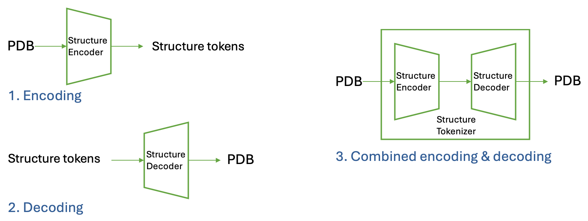
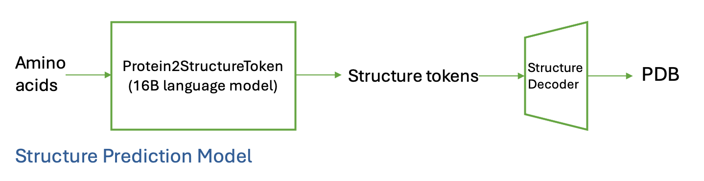
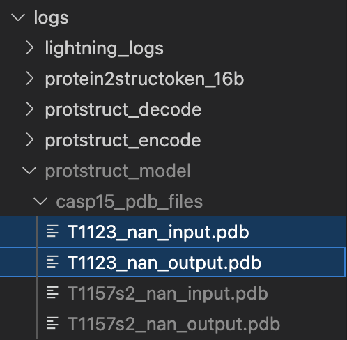
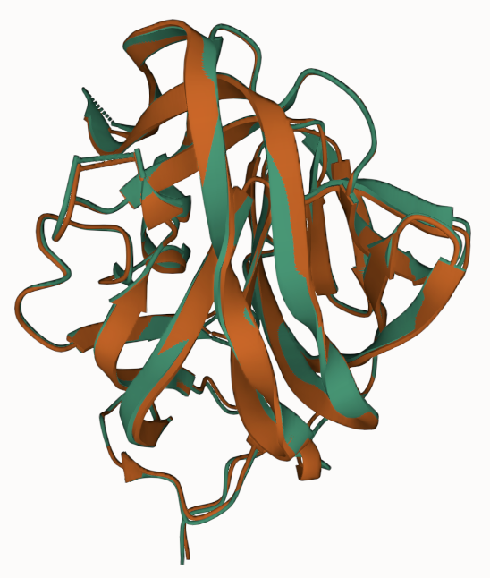
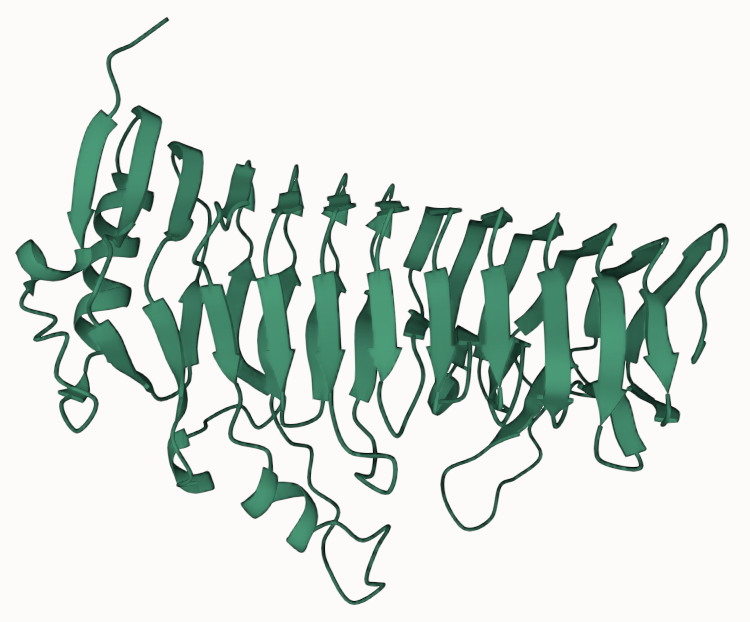

# Protein Structure Tokenizer

This repository provides tools for working with protein structures, including encoding protein structures into tokens, decoding tokens back into structures, and performing structure prediction tasks. Currently, we only support single-chain protein structures, but we plan to extend this to multi-chain structures in the future.

**Notes:**
The below contents only support inference. Training is not included. Training the structure tokenizer and the structure prediction model requires a large amount of data and computational resources (hundreds of GPU-days), which is beyond the scope of the current repository.

## Table of Contents

1. [Models](#models)
   - [Structure Tokenizer](#structure-tokenizer)
   - [Structure Prediction Model (16B Language Model)](#structure-prediction-model)
2. [Tasks](#tasks)
   - [Quick Start](#quick-start)
   - [Encoding Structures into Tokens](#encoding-structures-into-tokens)
   - [Decoding Tokens into Structures](#decoding-tokens-into-structures)
   - [Combining Encode and Decode](#combining-encode-and-decode)
   - [Structure Prediction](#structure-prediction)

---

## Models

This repository includes two key models used for working with protein structures:

### Structure Tokenizer


The **Structure Tokenizer** model is designed to encode protein structures into discrete structure tokens and decode these tokens back into protein structures. It provides an efficient way to represent complex structural information in a compact, tokenized form.  
Key Features:
- **Encoding**: Converts protein structures into discrete tokens.
- **Decoding**: Reconstructs protein structures from tokens.
- **Combined Encoding & Decoding**: Supports running both processes in a single pipeline.



Relevant configuration files:
- `encode.yaml` for encoding tasks.
- `decode.yaml` for decoding tasks.
- `encode_decode.yaml` for combined encoding and decoding.

Relevant huggingface models:
- `genbio-ai/AIDO.StructureEncoder` is the model for encoding protein structures into tokens.
- `genbio-ai/AIDO.StructureDecoder` is the model for decoding tokens back into protein structures.
- `genbio-ai/AIDO.StructureTokenizer` is the combined model for encoding and decoding protein structures.

### Structure Prediction Model (16B Language Model)

The **Structure Prediction Model** uses a pre-trained 16B language model to predict protein structure tokens directly from amino acid sequences. This allows for end-to-end prediction of protein structures.

Workflow:
1. Input amino acid sequences.
2. Predict structure tokens using the language model.
3. Decode the predicted tokens into protein structures using the Structure Tokenizer.


Relevant configuration files:
- `protein2structoken_16b.yaml` for predicting structure tokens from amino acid sequences.
- `decode.yaml` for decoding predicted tokens into structures.

Relevant huggingface models:
- `genbio-ai/AIDO.Protein2StructureToken-16B` is the model for predicting protein structure tokens from amino acid sequences.
- `genbio-ai/AIDO.StructureDecoder` is the model for decoding predicted tokens back into protein structures.

<!-- ## Setup

Make sure all dependencies are installed, including the ModelGenerator (`mgen`) framework.
For pulling dataset from huggingface, you need `huggingface-hub` installed. -->

## Tasks

### Quick Start

If you want to have a quick try of the features without reading the detailed instructions in the following sections,
you could run the following scripts that pack the commands for encoding, decoding, and structure prediction tasks.
- `experiments/AIDO.StructureTokenizer/structure_encoding.sh`: Packs the commands for encoding and decoding tasks.
- `experiments/AIDO.StructureTokenizer/structure_prediction.sh`: Packs the commands for structure prediction and decoding tasks.
The outputs are under the `logs/` directory.

**Notes:**
- The above scripts are designed for the sample dataset. If you want to use your own dataset, please go through the detailed instructions in the following sections.
- The 16B language model is quite large. You need to have enough storage in your HF cache directory and downloading the model could take a long time. Loading the checkpoint from the disk could take 4 minutes or more depending on your hardware.

### Encoding Structures into Tokens

We can use the structure tokenizer to convert protein structures into structure tokens. First, we need to prepare the dataset for encoding. You could either use the sample dataset provided or prepare your own dataset.

#### Preparing Sample Dataset

You can download the sample dataset from the Hugging Face hub. Run the following command to download the dataset to the `data/protstruct_sample_data/` directory (run this command in the root directory of the repository):
```bash
huggingface-cli download genbio-ai/sample-structure-dataset --repo-type dataset --local-dir ./data/protstruct_sample_data/
```

This dataset is based on the CASP15 dataset, which can be referenced at:
- [CASP15 Prediction Center](https://predictioncenter.org/casp15/)
- [Bhattacharya-Lab/CASP15](https://github.com/Bhattacharya-Lab/CASP15)

The downloaded directory includes:
- A `registries` folder containing a CSV file with metadata such as filenames and PDB IDs.
- A `CASP15_merged` folder containing PDB files, where domains are merged in the same way as described in [Bhattacharya-Lab/CASP15](https://github.com/Bhattacharya-Lab/CASP15).

#### Preparing Your Own Dataset

If you want to use your own dataset for testing the structure tokenizer model, you can prepare a dataset with the following structure:
- A folder containing PDB files (supported formats: `cif.gz`, `cif`, `ent.gz`, `pdb`).

Then, you need to prepare a registry file in CSV format using the following command:
``` bash
python experiments/AIDO.StructureTokenizer/register_dataset.py \
    --folder_path /path/to/folder_path \
    --format cif.gz \
    --output_file /path/to/output_file.csv
```

Example (if you have a folder with PDB files in `data/protstruct_sample_data/CASP15_merged/`):
``` bash
python experiments/AIDO.StructureTokenizer/register_dataset.py \
    --folder_path data/protstruct_sample_data/CASP15_merged/ \
    --format pdb \
    --output_file data/protstruct_sample_data/registries/casp15_merged_copy.csv
```

#### Running Encoding Task

If you use the sample dataset, you can run the encoding task using the following command:
```bash
CUDA_VISIBLE_DEVICES=0 mgen predict --config experiments/AIDO.StructureTokenizer/encode.yaml
```

If you use your own dataset, you need to update the `folder_path` and the `registry_path` in the `encode.yaml` configuration file to point to your dataset folder and registry file. Alternatively, you can override these parameters when running the command:
```bash
CUDA_VISIBLE_DEVICES=0 mgen predict --config experiments/AIDO.StructureTokenizer/encode.yaml \
    --data.init_args.config.proteins_datasets_configs.name="your_dataset_name" \
    --data.init_args.config.proteins_datasets_configs.registry_path="your_dataset_folder_path" \
    --data.init_args.config.proteins_datasets_configs.folder_path="your_dataset_registry_path" \
    --trainer.callbacks.dict_kwargs.output_dir="your_output_dir"
```

**Input:**
- The PDB files in the dataset folder.
- The registry file in CSV format indicating the metadata of the dataset.

**Output:**
- The encoded tokens will be saved in the output directory specified in the configuration file. By default it is saved in `logs/protstruct_encode/`.
- The encoded tokens are saved as a `.pt` file, which can be loaded using PyTorch. Inside the file, it's a dictionary that maps the name of the protein to the encoded tokens (`struct_tokens`) and other auxiliary information (`aatype`, `residue_index`) for reconstruction.
  The structure of the dictionary is as follows:
  ```python
  {
      'T1137s5_nan': { # the nan here is the chain id and CASP15 doesn't have chain id
          'struct_tokens': tensor([449, 313, 207, 129, ...]),
          'aatype': tensor([ 4,  7,  5, 17, ...]),
          'residue_index': tensor([ 33,  34,  35,  36, ...]),
      },
      ...
  }
  ```
- A codebook file (`codebook.pt`) that contains the embedding of each token. The shape is `(num_tokens, embedding_dim)`.

**Notes:**
- Currently, this function only supports single GPU inference due to the file saving mechanism. We plan to support multi-GPU inference in the future.
- The auxiliary information (`aatype` and `residue_index`) can be substituted with placeholder values if not required.
    - `aatype`: This parameter is used to reconstruct the protein sidechains. If sidechain reconstruction is not needed, you can assign dummy values (e.g., all zeros).
    - `residue_index`: This parameter helps the model identify gaps in residue numbering, which can influence structural predictions. If gaps are present, the model may introduce holes in the structure. For structures without gaps, you can use a continuous sequence of integers (e.g., 0 to n-1).
- You may need to adjust the `max_nb_res` parameter in the configuration file based on the maximum number of residues in your dataset. For those proteins with more residues than `max_nb_res`, the model will truncate the residues. The default value is set to 1024.

### Decoding Tokens into Structures

We can use the decoder from the structure tokenizer to convert the encoded tokens back into protein structures. The decoder requires the encoded tokens and the codebook file. The decoded structures are saved as PDB files. Both backbone and sidechain atoms are reconstructed.

#### Decoding the Sample Dataset
If you have run the encoding task above on the sample dataset, the default `decode.yaml` configuration file is already set up to decode the encoded tokens. You don't need to change anything in the configuration file. You can directly run the decoding task using the following command:

```bash
CUDA_VISIBLE_DEVICES=0 mgen predict --config=experiments/AIDO.StructureTokenizer/decode.yaml
```

#### Decoding Your Structure Tokens
To decode protein structures, you will need the structure tokens in `.pt` format and a corresponding codebook file (`codebook.pt`). For ease of use, we recommend preparing the structure tokens in TSV format and then converting them to `.pt` format using the provided script. 

The TSV file should include the following columns (an example file is available at `experiments/AIDO.StructureTokenizer/decode_example_input.tsv`):
- `uid`: A unique identifier for the protein sequence.
- `sequences`: The amino acid sequence (e.g., "LRTPTT").
- `predictions`: The structure tokens to be decoded, provided as a list (e.g., "[164, 287, 119, ...]"). The list length must match the length of the amino acid sequence.


After preparing the TSV file, you need to convert the TSV file to the `.pt` format using the following command:
```bash
python experiments/AIDO.StructureTokenizer/struct_token_format_conversion.py your_tsv_file.tsv your_output_pt_file.pt
```

You also need to prepare a codebook file (`codebook.pt`) that contains the embedding of each token. The codebook could be extracted using this command:
```bash
python experiments/AIDO.StructureTokenizer/extract_structure_tokenizer_codebook.py --output_path your_output_codebook.pt
```

Then you need to update the `struct_tokens_path` and `codebook_path` in the `decode.yaml` configuration file to point to your structure tokens and codebook file. Alternatively, you can override these parameters when running the command:
```bash
CUDA_VISIBLE_DEVICES=0 mgen predict --config experiments/AIDO.StructureTokenizer/decode.yaml \
 --data.init_args.config.struct_tokens_datasets_configs.name="your_dataset_name" \
 --data.init_args.config.struct_tokens_datasets_configs.struct_tokens_path="your_structure_tokens.pt" \
 --data.init_args.config.struct_tokens_datasets_configs.codebook_path="your_codebook.pt" \
 --trainer.callbacks.dict_kwargs.dirpath="your_output_dir"
```

**Input:**
- The encoded tokens saved in `.pt` format.
- The codebook file (`codebook.pt`) that contains the embedding of each token.

**Output:**
- The decoded protein structures will be saved in the output directory specified in the configuration file. By default it is saved in `logs/protstruct_decode/`.
- The decoded structures are saved as PDB files.

**Notes:**
- Decoding the structures could take a long time even when using a GPU.
- Currently, this function only supports single GPU inference due to the file saving mechanism. We plan to support multi-GPU inference in the future.
- Currently, we don't support specifying the residue index in TSV format. If you need to specify the residue index, you need to modify the 
`struct_token_format_conversion.py` script to include the residue index in the TSV file (we may support this feature in the future), or you could provide the `.pt` file directly with the desired residue index.

### Combining Encode and Decode

We can combine the encoding and decoding tasks into a single pipeline. This will output the original structure and the reconstructed structure in the same directory. Each reconstruction is aligned to the original structure using the Kabsch algorithm.

#### Data Preparation
The data preparation is the same as [Encoding Structures into Tokens](#encoding-structures-into-tokens).

#### Running Combined Encoding and Decoding Task

If you use the sample dataset, you can run the combined encoding and decoding task using the following command:
```bash
CUDA_VISIBLE_DEVICES=0 mgen predict --config=experiments/AIDO.StructureTokenizer/encode_decode.yaml
```

If you use your own dataset, you need to update the `folder_path` and the `registry_path` in the `encode_decode.yaml` configuration file or override them when running the command as described in [Encoding Structures into Tokens](#encoding-structures-into-tokens). 

Example:
```bash
CUDA_VISIBLE_DEVICES=0 mgen predict --config experiments/AIDO.StructuctureTokenizer/encode_decode.yaml \
    --data.init_args.config.proteins_datasets_configs.name="your_dataset_name" \
    --data.init_args.config.proteins_datasets_configs.registry_path="your_dataset_folder_path" \
    --data.init_args.config.proteins_datasets_configs.folder_path="your_dataset_registry_path" \
    --trainer.callbacks.dict_kwargs.output_dir="your_output_dir"
```

**Input:**
- The PDB files in the dataset folder.
- The registry file in CSV format indicating the metadata of the dataset.

**Output:**
- The decoded structures and their corresponding original structures will be saved in the output directory specified in the configuration file. By default it is saved in `logs/protstruct_model/`. 
- The decoded structures end with `output.pdb`.
- The original structures end with `input.pdb`.

**Notes:**
- Decoding the structures could take a long time even when using a GPU.
- Currently, this function only supports single GPU inference due to the file saving mechanism. We plan to support multi-GPU inference in the future.
- The reconstructed structures are aligned to the original structures using the Kabsch algorithm. This makes it easier to visualize and compare the structures.

#### Visualizing the Reconstructed Structures

We use VS Code + [Protein Viewer Extension](https://marketplace.visualstudio.com/items?itemName=ArianJamasb.protein-viewer) to visualize the protein structures. It's a beginner-friendly tool for VS Code users. You could also use your preferred protein structure viewer to visualize the structures (e.g., PyMOL, ChimeraX, etc.), but here we focus on this extension.

If you have run the [Combined Encoding and Decoding Task](#combining-encode-and-decode), you could find the decoded structures and their corresponding original structures in the output directory. You could visualize them as follows.
- Find the desired `output.pdb` and `input.pdb` pair in the side panel. Select both files when holding the `Ctrl` key (for Mac users, hold the `Cmd` key). 
- Right-click on the selected files and choose "Launch Protein Viewer". 
- A new tab will open with the protein structures displayed. You can interact with the structures using the Protein Viewer extension. Wwe have aligned the reconstructed structures to the original structures using the Kabsch algorithm, the displayed structures should be like this, where different colors mean different files. 

### Structure Prediction

We can use the structure prediction model to predict protein structure tokens directly from amino acid sequences. The predicted tokens can then be decoded into protein structures using the structure tokenizer.

#### Predicting Structure Tokens On CASP14, CASP15, and CAMEO Datasets

<!-- # 1. run the 16b language model to predict the structure tokens from protein sequences (amino acids)
# the input is the casp14, casp15, and cameo amino acid sequences (specified in the config file)
# the output is logs/protein2structoken_16b/predict_predictions.tsv
mgen predict --config experiments/AIDO.StructureTokenizer/protein2structoken_16b.yaml -->

We've provided a sample configuration file `protein2structoken_16b.yaml` that is set up to predict structure tokens from amino acid sequences in the CASP14, CASP15, and CAMEO datasets. You can run the structure prediction task using the following command:
```bash
mgen predict --config experiments/AIDO.StructureTokenizer/protein2structoken_16b.yaml
```
This will automatically download the preprocessed files from the Hugging Face hub and predict the structure tokens from the amino acid sequences. The predicted tokens will be saved in the `logs/protein2structoken_16b/predict_predictions.tsv` file.

#### Predicting Structure Tokens On Your Own Dataset

Alternatively, if you want to predict structure tokens from your own amino acid sequences, you can prepare a CSV file with the following structure:

| idx       | aa_seq                              |
|-----------|-------------------------------------|
| example   | KEFWNLDKNLQLRLGIVFLG                |

We've provided an example input file at `experiments/AIDO.StructureTokenizer/protein2structoken_example_input.csv` that you can use to test the structure prediction model. You can run the following command to predict the structure tokens from the amino acid sequences in the input file:
```bash
mgen predict --config experiments/AIDO.StructureTokenizer/protein2structoken_16b.yaml \
    --data.init_args.path=experiments/AIDO.StructureTokenizer/ \
    --data.init_args.test_split_files=[protein2structoken_example_input.csv]
```

#### Decoding Predicted Structure Tokens
We need to decode the predicted structure tokens into protein structures using the decoder. If you run the above configurations without changing the output path, you could follow the below commands to decode the predicted structure tokens.

``` bash
# 2. convert the predicted structures in tsv into one pt file
python experiments/AIDO.StructureTokenizer/struct_token_format_conversion.py logs/protein2structoken_16b/predict_predictions.tsv logs/protein2structoken_16b/predict_predictions.pt

# 3. extract the codebook of the structure tokenizer
# the output is logs/protein2structoken_16b/codebook.pt
python experiments/AIDO.StructureTokenizer/extract_structure_tokenizer_codebook.py --output_path logs/protein2structoken_16b/codebook.pt

# 4. run the decode model to convert the structure tokens into pdb files
# currently this script doesn't support multi-gpu, so only use one gpu
# the command line overrides the name, input structure tokens, and codebook path
# the output is logs/protein2structoken_16b/predict_predictions.pdb
CUDA_VISIBLE_DEVICES=0 mgen predict --config experiments/AIDO.StructureTokenizer/decode.yaml \
 --data.init_args.config.struct_tokens_datasets_configs.name=protein2structoken_16b \
 --data.init_args.config.struct_tokens_datasets_configs.struct_tokens_path=logs/protein2structoken_16b/predict_predictions.pt \
 --data.init_args.config.struct_tokens_datasets_configs.codebook_path=logs/protein2structoken_16b/codebook.pt
```

Here is an example visualization of `logs/protstruct_decode/protein2structoken_16b_pdb_files/cameo:0__output.pdb`.


**Notes:**
- While the language model part (amino acid sequence to structure tokens) is relatively fast and support multi-GPU, the decoding part (structure tokens to protein structures) is slower and currently only supports single GPU inference due to the file saving mechanism. We plan to support multi-GPU inference in the future.
- For CASP14, CASP15, and CAMEO datasets, you could find the corresponding ground truth structures in `genbio-ai/casp14-casp15-cameo-test-proteins`. You could use `huggingface-cli download genbio-ai/casp14-casp15-cameo-test-proteins --repo-type dataset --local-dir ./data/casp14-casp15-cameo-test-proteins/` to download the dataset.
- The TSV format doesn't support specifying the residue index in TSV format. Specifying the residue index will make the prediction more accurate.